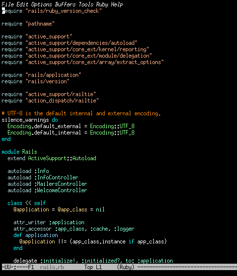

# helm-rdefs

The `helm-rdefs` provides [helm](https://github.com/emacs-helm/helm) interface for [rdefs](https://github.com/knsmr/rdefs).

## Screenshot



## Install

1. Install [rdefs](https://github.com/knsmr/rdefs).
2. Load `helm-rdefs.el`

## Usage

Run `helm-rdefs` in `.rb` file.

## Example config

```elisp
(define-key ruby-mode-map (kbd "C-c r") 'helm-rdefs)
```
